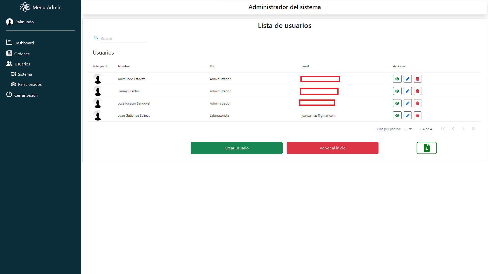

# frontend-ordenes-adm
La aplicación de administración de órdenes de trabajo fue creada para la asignatura Portafolio de Título del DuocUC, esta aplicación usa la API REST del repositorio <a href="https://github.com/Mumoide/backend-ordenes-adm">backend-ordenes-adm</a> para realizar la comunicación entre el frontend y la base de datos MySQL.

Su función es administrar las órdenes de trabajo de un laboratorio dental, las principales funciones de software que contiene son:
  - Login con uso de token.
  - Roles de usuarios.
  - Recuperación de cuenta con mailer.
  - CRUD de usuarios, órdenes y etapas de las órdenes.
  - Asignación de trajadores en órdenes.
  - Dashboard.
  - Exportación de datos en excel.

A continuación se mostrarán imagenes de la aplicación:

<h2>Login:</h2>

<h2>Recuperación de cuenta:</h2>

<h2>Dashboard:</h2>

<h2>Tablas de datos:</h2>

<h3>Órdenes:</h3>

<h3>Usuarios:</h3>

<h3>Etapas:</h3>

<h2>Edición de usuario:</h2>

<h2>Visualización de usuario editado:</h2>

<h2>Validaciones:</h2>

<h3>Desde el front:</h3>

<h3>Desde el back:</h3>

<h2>Alertas:</h2>

<h3>Sweetalert2:</h3>

<h3>Toastify:</h3>

